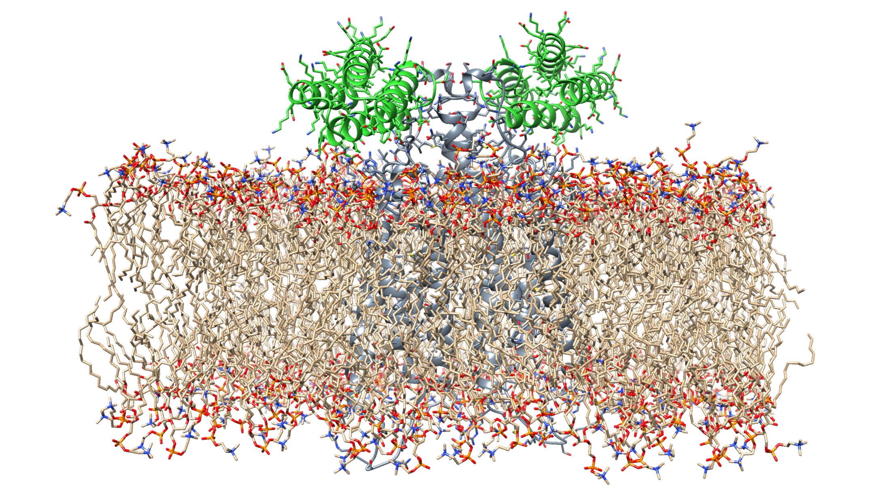
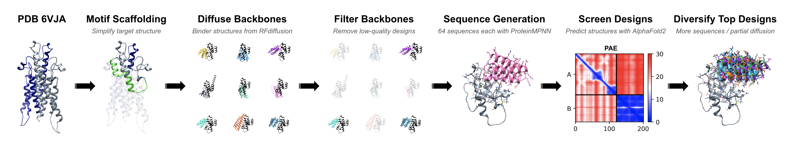

# BioML Challenge 2024: Bits to Binders
## Team Name: "Tumor Inhibitors"

  

## Team Members

Rana Barghout, Cianna Calia, Ashish Makani, Javier Marchena-Hurtado, Matthew Williams

## Abstract

Expanding the set of known protein binders to human CD20 holds promise for medical applications such as CAR T-cell therapies for B-cell malignancies. However, CD20 presents a challenging target for de novo binder design for multiple reasons: The extracellular loops (ECL1/ECL2) protruding out of the cell membrane provide relatively small surfaces for binding and contain many hydrophilic residues [1], and judging by the slightly lower pLDDT in these loops in CD20's AlphaFoldDB structure [2, 3], the exposed regions may also have some degree of flexibility. We therefore constructed a multi-tiered approach to attempt to maximize the success rate of CD20 binders we generated with state-of-the-art deep learning tools. First, we used RFdiffusion's [4] motif scaffolding functionality to create a minimal target structure consisting of segments of both CD20 monomers from PDB 6VJA [1], united into a single asymmetrical chain by two diffused glycine linkers. With this structure as the provided target, we used RFdiffusion's "beta" complex parameters to generate over 25,000 80-residue binder backbones. To allow us to generate many sequences per backbone without wasting time on low-quality designs, we filtered our backbones using Biopython [5] to ensure contact with Tyr161 in CD20's ECL2, to prohibit contact with the nearest diffused linker, and to avoid binders with excessively long helices and/or too few target contacts. We also eliminated any backbones incompatible with the cell membrane by aligning each target-binder complex to a membrane-embedded structure of CD20 from MemProtMD [6] and discarding any backbones with more than 10 heavy-atom clashes between the binder and the lipids. For all backbones passing this filtering, we used the ColabDesign framework [7] to run ProteinMPNN [8] to generate 64 sequences each with a sampling temperature of 0.000001, followed by screening with AlphaFold2 (using model_1_ptm with initial guess, target templating, three recycles, and no MSAs) [9, 10]. Because we found binders with pae_interaction < 10 to be rare, we prioritized further exploration of the sequence and structure space surrounding "near hits" that had pae_interaction < 22 and RMSD < 8 Å with respect to the designed structure; for all backbones giving one or more near-hit sequences we generated and screened 64 additional sequences with a sampling temperature of 0.1, and for some promising candidates we generated still more sequences and in several cases also diversified the binder backbone with partial diffusion. With these methods we compiled 1,323 binder sequences with pae_interaction < 22 and RMSD < 8 Å, which we ranked by pae_interaction (and re-ranked by RMSD within pae_interaction windows of 1.0). After discarding those with pLDDT < 80, those with long alanine stretches, and those within 20 amino acids of higher ranking candidates, 868 sequences remained. Our submission contains the highest ranking 500 of these remaining sequences.

## Workflow

  

 - RFdiffusion [4] to create minimal target structure from PDB 6VJA [1]
 - RFdiffusion [4] to generate binder backbones
 - Backbone filtering with Biopython [5] and check for membrane clashes using structure from MemProtMD [6]
 - ProteinMPNN [8] to generate sequences (via ColabDesign [7])
 - AlphaFold2 [9] with initial guess [10] to screen designs (via ColabDesign [7])
 - Additional sequence generation / partial diffusion for best designs
 - Rank best sequences by pae_interaction and RMSD

## Files Included

 - **Run_ProteinMPNN_and_AlphaFold2_for_RFdiffusion_Binders_with_ColabDesign_gdrive.ipynb:** Colab notebook for running ProteinMPNN/AlphaFold2 via the ColabDesign framework for RFdiffusion binder backbones.
 - **Filter_RFD_backbones_with_membrane_check.py:** Script for filtering RFdiffusion binder backbones to remove low-quality binder structures, incorrectly located binders, and binder backbones that clash with the cell membrane. Requires a copy of 6y97_default_dppc.mpmd.finalframe.atomistic.pdb from [MemProtMD](https://memprotmd.bioch.ox.ac.uk/_ref/PDB/6y97/_sim/6y97_default_dppc/) with solvent/ions deleted.
 - **Filter_CD_AF_output_fasta_RFD_pdbs.py:** Script for identifying best designs based on AlphaFold2 metrics from outputs of Run_ProteinMPNN_and_AlphaFold2_for_RFdiffusion_Binders_with_ColabDesign_gdrive.ipynb. Basically just organizes the notebook's outputs.
 - **v4_csv-to-fasta.py** Script to convert our spreadsheet of designed sequences to the final fasta for submission, with sequences ranked based on pae_interaction and RMSD.
 - **full_protocol.txt:** Full details of our workflow, including all RFdiffusion commands.
 - **CD20_Binders.fasta:** The fasta file we submitted, with our top 500 sequences.
 - **CD20_Binders.csv:** Spreadsheet containing all sequences we obtained with pae_interaction < 22 and RMSD < 8 Å, and their AlphaFold2 metrics.

## References

\[1\] [Rougé et al. *Science*, 2020.](https://www.science.org/doi/10.1126/science.aaz9356)\
\[2\] [Varadi et al. *Nucleic Acids Research*, 2022.](https://academic.oup.com/nar/article/50/D1/D439/6430488)\
\[3\] [Tunyasuvunakool et al. *Nature*, 2021.](https://www.nature.com/articles/s41586-021-03828-1)\
\[4\] [Watson et al. *Nature*, 2023.](https://www.nature.com/articles/s41586-023-06415-8)\
\[5\] [Cock et al. *Bioinformatics*, 2009.](https://academic.oup.com/bioinformatics/article/25/11/1422/330687)\
\[6\] [Newport et al. *Nucleic Acids Research*, 2019.](https://academic.oup.com/nar/article/47/D1/D390/5173663)\
\[7\] [Ovchinnikov et al. ColabDesign Framework.](https://github.com/sokrypton/ColabDesign)\
\[8\] [Dauparas et al. *Science*, 2022.](https://www.science.org/doi/full/10.1126/science.add2187)\
\[9\] [Jumper et al. *Nature*, 2021.](https://www.nature.com/articles/s41586-021-03819-2)\
\[10\] [Bennett et al. *Nature Communications*, 2023.](https://www.nature.com/articles/s41467-023-38328-5)

